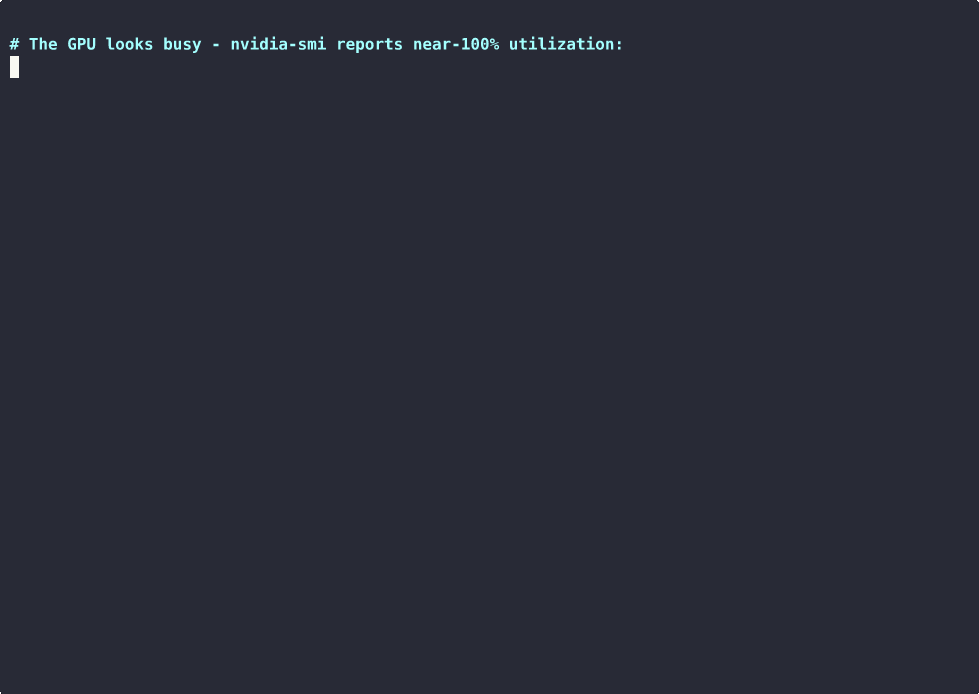

# Ingero Scan - wasted GPU MFU meter for vLLM & SGLang inference

**Your GPU dashboard says 100% utilization. It is lying to you.**

DCGM and `nvidia-smi` report "100% GPU utilization" when a kernel is merely
resident on the device, not when the GPU is doing useful math. A serving GPU can
sit at 100% "utilization" and 5% MFU (Model FLOPs Utilization) at the same time:
you are paying for FLOPs you never get. `scan` reads your serving engine's
Prometheus `/metrics` and the GPU model and shows you the real number. No root,
no eBPF, nothing running in your serving path.



```
$ nvidia-smi --query-gpu=name,utilization.gpu --format=csv,noheader
NVIDIA A100-SXM4-40GB, 92 %

$ scan --endpoint http://localhost:8001/metrics --model qwen2-7b --rate 1.10
GPU MFU scan (ESTIMATE - modeled, not measured)
  workload : qwen2-7b on 1x NVIDIA A100-SXM4-40GB
  output   : 891 tokens/sec  ->  12 of 312 TFLOP/s used
  util     : 91%   (nvidia-smi GPU utilization - what the dashboard shows)
  MFU      : 4.0%   (the real work behind that utilization)
  headroom : ~11x below well-batched serving (~35-50% MFU, public benchmark)
  cost     : ~$803/mo at $1.10/GPU/hr (--rate, upper bound)
  envelope : up to ~$711-$739/mo of consolidation headroom (CEILING, not a promise)
```

Recorded live on an A100 under real open-loop load: **91% reported utilization,
~4% MFU.** The chip is busy holding kernels, not turning them into tokens. And
this is not a server buckling under load: the same run **met its latency SLO**
(p95 7.3s under an 8s target, 0 errors over 1500+ requests) while sitting at ~4%
MFU. That gap is healthy-server waste you are paying for. (Full recording:
[`docs/scan-demo.cast`](docs/scan-demo.cast).)

## Try it in 30 seconds (on a GPU box)

scan needs a real GPU. It reads live utilization from the host's own vendor tool
(`nvidia-smi` on NVIDIA, `amd-smi` or `rocm-smi` on AMD/ROCm) and contrasts it
with the work the GPU is actually doing - there is nothing real to show without
one, so with no GPU it exits instead of printing numbers you cannot trust. On any
Linux host with an NVIDIA or AMD GPU already serving an engine:

```
curl -sSL https://github.com/ingero-io/scan/releases/latest/download/scan_linux_amd64.tar.gz | tar xz
./scan --endpoint http://localhost:8000/metrics --model llama-3-70b
```

No engine up yet? `demo/reproduce.sh` stands up vLLM under realistic load and
scans it end to end - one cheap datacenter GPU (L4 / A10 / A100) is plenty
([real-engine walkthrough](#on-a-real-engine)).

## What it does

1. Reads the engine's `/metrics` twice over a short window and derives achieved
   output tokens/sec.
2. Converts that to achieved TFLOP/s using the standard ~2 FLOPs/param/token
   transformer-decode approximation.
3. Divides by the GPU's published dense BF16/FP16 peak to get MFU.
4. Frames the gap as a consolidation-headroom CEILING against a published
   healthy-serving MFU band (~35-50%), priced at your GPU rate.

That is the whole tool: one number, one command, no install in your serving path.

## From the gap to a receipt

`scan` is deliberately a symptom check. It shows the gap exists and roughly how
much spend sits in it, as a ceiling. It will not tell you which GPUs you can
actually consolidate, whether your SLO survives the move, or what the recovered
dollars really are. Reaching past a ceiling takes measurement `scan` does not do.

That is the **Ingero agent**: it attributes the gap to a specific cause, measures
the SLO-safe recoverable GPU-hours on your real traffic, and produces a signed
before/after recovered-hours receipt, the number you hand to finance. `scan`
shows you the gap for free; the agent recovers it and proves the dollars.

Want the cause, the SLO-safe recoverable hours, and a signed receipt?
Drop us an email: info@ingero.io.

## Install

Prebuilt binary, no toolchain (linux/macOS, amd64/arm64):

```
curl -sSL https://github.com/ingero-io/scan/releases/latest/download/scan_linux_amd64.tar.gz | tar xz
./scan --version
```

With a Go toolchain:

```
go install github.com/ingero-io/scan/cmd/scan@latest
```

Or build from source:

```
git clone https://github.com/ingero-io/scan
cd scan
go build -o scan ./cmd/scan
```

## Usage

```
scan --endpoint http://localhost:8000/metrics --model llama-3-70b
```

The GPU model and count are detected from `nvidia-smi`, or from `amd-smi` with a
`rocm-smi` fallback on ROCm hosts (a GPU is required). `--gpu` / `--gpu-count`
override the label used for the rate and peak tables when the detected name is
not one scan recognizes; they do not let scan run without a GPU. `--rate` sets
your real $/GPU-hr:

```
scan --model mixtral-8x7b --rate 2.49
```

For a model not in the built-in table, give the active params/token directly:

```
scan --model my-finetune --params 8e9 --gpu A100
```

### On a real engine

Serve any vLLM-compatible server that exposes `/metrics`, send it traffic so the
token counter advances, then scan while it serves:

```
python3 -m venv vllmenv && vllmenv/bin/pip install vllm
vllmenv/bin/vllm serve Qwen/Qwen2-7B-Instruct --port 8000 --max-model-len 8192
# ... drive some traffic ...
scan --endpoint http://localhost:8000/metrics --model qwen2-7b
```

`demo/` has a self-contained reproduction: a load generator plus the exact run
behind the recording above.

### Live board (continuous mode)

By default `scan` takes one reading and exits. `--prometheus <addr>` keeps it
running: it re-samples every `--interval` and serves a Prometheus exposition, so
Prometheus and Grafana can graph the gap over time instead of printing it once.

```
scan --endpoint http://localhost:8000/metrics --model qwen2-7b --rate 1.10 \
     --prometheus :9100
curl localhost:9100/metrics
```

It publishes only the gap and the public envelope (util, MFU, achieved/peak
TFLOP/s, tokens/sec, the monthly headroom bounds, and the public healthy band).
`demo/board-compose.yaml` stands up Prometheus + Grafana with a ready board; see
`demo/README.md`.

## Flags

| Flag | Default | Meaning |
|------|---------|---------|
| `--endpoint` | `http://localhost:8000/metrics` | serving engine Prometheus `/metrics` URL |
| `--engine` | `vllm` | serving engine: `vllm`, `sglang`, or `tgi` |
| `--model` | | model name (e.g. `llama-3-70b`); or use `--params` |
| `--params` | | active params/token for an unknown model (e.g. `8e9`) |
| `--gpu` | detected | override the GPU model used for the rate/peak tables |
| `--gpu-count` | detected | override the detected GPU count |
| `--rate` | | your real USD/hr per GPU (overrides the bundled list price) |
| `--interval` | `15s` | sampling window |
| `--prometheus` | | serve a Prometheus `/metrics` exposition on this addr (e.g. `:9100`) and re-sample every `--interval`, instead of running once |

## Supported engines

`scan` reads output-token throughput from vLLM (and vLLM-compatible servers like
NIM), SGLang, and TGI. Triton is detected but not supported for scanning: it
exposes no output-token counter, so there is no way to derive tokens/sec from it.

## GPUs

NVIDIA and AMD Instinct. The peak table carries H100, H200, GH200, B200, A100,
L40S, L4, A10/A10G, V100, T4, and MI300X, MI325X, MI350X, MI355X, using each
vendor's published dense BF16/FP16 figures. A GPU whose model is not in the table
is an error rather than a guess: pass `--gpu` with a name scan recognizes, or
open an issue and it can be added. The AMD reading is new; if a number looks
wrong on your ROCm host, the raw `amd-smi metric --json` output in an issue is
the fastest way to get it fixed.

## This is an estimate, on purpose

`scan` under-claims by design, so the number is one you can trust before you
trust the tool. Read it as "you are in the ballpark of X% MFU," not a certified
figure:

- FLOPs/token uses the ~2N dense-forward approximation. It ignores the attention
  term (small for typical context vs model size) and treats the model as dense,
  so it understates FLOPs for very long contexts.
- For MoE models it uses ACTIVE params/token, not total. Verify the active-param
  count for your variant.
- Peak TFLOP/s is the vendor dense BF16/FP16 spec. Real sustained peak is lower,
  and FP8/INT8 serving has a higher peak than these BF16 numbers, so MFU is
  conservative for BF16/FP16 serving and overstated for FP8.
- Bundled GPU rates are public list prices and an upper bound on real exposure.
  Pass `--rate` for your contracted price.

If MFU comes out above 100%, the inputs are inconsistent (wrong dtype, wrong
params, or wrong GPU) and `scan` flags it instead of printing a nonsense number.
The precise, measured number, and the recovered-hours receipt, are the agent's.

## License

Apache 2.0. See [LICENSE](LICENSE).
